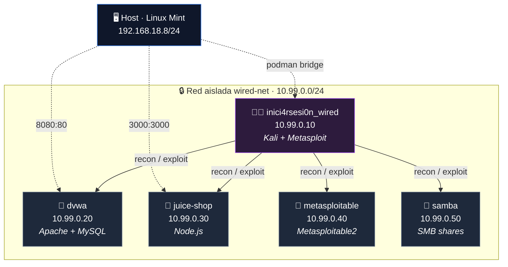

# 🛡️ Wired-CyberRange — Laboratorio de Pentesting con Podman

[](https://podman.io/)
[](https://www.kernel.org/)
[](https://www.gnu.org/licenses/gpl-3.0)
[](https://www.gnu.org/software/make/)
[](https://www.gnu.org/software/bash/)
[](https://yaml.org/)
[](https://github.com/containers/podman-compose)

Laboratorio reproducible de pentesting construido con **Podman rootless**. Simula un entorno empresarial con múltiples objetivos vulnerables en una red aislada, más un contenedor atacante equipado con las herramientas necesarias para reconocimiento, enumeración, explotación y post-explotación.

Diseñado para practicar técnicas de **Red Team**, documentar hallazgos con **CVSS** y mapeo **MITRE ATT&CK**, y servir como base para un framework de automatización.

> ℹ️ **Estado del repositorio:** publicado · **Versión:** `lab-v1.0` · **Licencia:** GPLv3

---

## ✨ Características Principales

- **Podman rootless** — sin daemon, sin privilegios de root en el host.
- **Red aislada** — subnet `10.99.0.0/24` fuera de rangos comunes, sin conflicto con la red del host.
- **IPs estáticas** — asignación fija por contenedor para scripts reproducibles.
- **Perfiles modulares** — levantar solo lo necesario según el reto (`recon`, `web`, `smb`, `full`).
- **DNS interno de Podman** — resolución por hostname entre contenedores.
- **Atacante con capabilities** — `NET_ADMIN` y `NET_RAW` para `nmap -sS`, `tcpdump` y `scapy`.
- **Volúmenes persistentes** — scripts, evidencia y reportes sobreviven al ciclo `down` / `up`.
- **Healthcheck parametrizable** — verificación automática por perfil con reintentos.
- **Smoke test** — verificación del ciclo completo de los 4 perfiles en un comando.

---

## 📋 Requisitos

| Componente | Versión mínima | Notas |
|------------|----------------|-------|
| **SO** | Linux | Probado en Linux Mint 22.1 Xfce, kernel 6.8 |
| **Podman** | 4.9+ | Modo rootless |
| **podman-compose** | 1.0.6+ | — |
| **Make** | GNU Make | — |

### 🖥️ Hardware de referencia

El laboratorio fue construido y validado en hardware de gama baja. Estas son las especificaciones reales:

| Recurso | Mínimo | Recomendado | Probado en |
|---------|--------|-------------|------------|
| **CPU** | 2 cores x86_64 | 4 cores @ 2.0 GHz+ | Intel Pentium Silver N5030 (4 cores, 2.8-3.1 GHz) |
| **RAM total (host)** | 4 GB | 8 GB | 7.3 GB |
| **RAM libre** | 2 GB (perfil `recon`) | 4 GB (perfil `full`) | ~4 GB libres |
| **Disco libre** | 15 GB | 30 GB | 143 GB libres |
| **Kernel** | Linux 5.15+ | Linux 6.8+ | Linux 6.8 (Mint 22.1) |

**Notas:**

- En un host con **< 4 GB de RAM libre**, evitar el perfil `full` y usar perfiles modulares según el reto.
- El **build inicial** de la imagen del atacante requiere picos de CPU y ~15 minutos en hardware modesto.
- El laboratorio está diseñado para funcionar en **hardware de gama baja** — no requiere GPU ni máquina dedicada.

**Espacio en disco (aproximado):**

| Componente | Tamaño |
|------------|--------|
| Imagen del atacante (Kali + Metasploit) | ~4.3 GB |
| Imagen de Metasploitable2 | ~1.5 GB |
| Imagen de Juice Shop | ~600 MB |
| Imagen de DVWA | ~500 MB |
| Imagen de Samba | ~50 MB |
| **Total estimado** | **~7 GB** |

Se recomiendan **20 GB libres** para dar margen a capas intermedias, snapshots de Podman y espacio de trabajo.

---

## 🚀 Quick Start

```bash
# 1. Configurar variables de entorno
cp .env.example .env

# 2. Crear la red del laboratorio (primera vez)
make setup

# 3. Construir la imagen del atacante (primera vez, ~15 min)
#    Base: kalilinux/kali-rolling + Metasploit Framework
make build

# 4. Levantar el perfil web
make up-web

# 5. Verificar que todo esté sano
make health PROFILE=web

# 6. Conectar al contenedor atacante
make shell
```

**Smoke test rápido** — verifica el ciclo completo de los 4 perfiles en un comando:

```bash
make smoke
# Tarda ~5-8 min. Salida esperada: "═══ TODOS LOS PERFILES PASARON ═══"
```

> 💡 Dentro del atacante ya tienes `nmap`, `metasploit`, `sqlmap`, `enum4linux`, `smbclient`, `nikto`, `hydra`, `john`, `hashcat`, `tcpdump` y más.

### Ejemplo de uso

```bash
$ make up-web
>>> Levantando perfil: web
inici4rsesi0n_wired    Up 6 seconds
dvwa                   Up 6 seconds   0.0.0.0:8080->80/tcp
juice-shop             Up 5 seconds   0.0.0.0:3000->3000/tcp

$ make shell
┌──(root㉿inici4rsesi0n_wired)-[/opt/scripts]
└─# nmap -sS -p 80,3306 10.99.0.20
Starting Nmap 7.99
Nmap scan report for dvwa (10.99.0.20)
PORT     STATE SERVICE
80/tcp   open  http
3306/tcp open  mysql

┌──(root㉿inici4rsesi0n_wired)-[/opt/scripts]
└─# echo "FTP anónimo detectado" > /opt/evidence/recon-notes.txt
┌──(root㉿inici4rsesi0n_wired)-[/opt/scripts]
└─# exit

# La evidencia persiste en el host:
$ cat volumes/wired/evidence/recon-notes.txt
FTP anónimo detectado
```

---

## 🎯 Perfiles Disponibles

Los perfiles se levantan por separado para no saturar la RAM del host.

| Perfil | Contenedores | RAM aprox. | Uso típico |
|--------|--------------|------------|------------|
| **recon** | attacker | ~1.5 GB | Preparar scripts, reconocimiento puro |
| **web** | attacker + dvwa + juice-shop | ~2.3 GB | Retos web (SQLi, XSS, IDOR) |
| **smb** | attacker + metasploitable + samba | ~2.4 GB | Retos SMB, FTP, servicios de red |
| **full** | todos | ~3.2 GB | Retos completos, movimiento lateral |

---

## 🧱 Arquitectura

### 🌐 Topología de red



### 📦 Inventario de contenedores

| Contenedor | Imagen | IP | Puerto host |
|------------|--------|----|-------------|
| **inici4rsesi0n_wired** | Custom (Kali Rolling + Metasploit) | 10.99.0.10 | — (acceso vía `make shell`) |
| **dvwa** | `citizenstig/dvwa` | 10.99.0.20 | `8080:80` |
| **juice-shop** | `bkimminich/juice-shop` | 10.99.0.30 | `3000:3000` |
| **metasploitable** | `tleemcjr/metasploitable2` | 10.99.0.40 | — (acceso solo desde el atacante) |
| **samba** | `dperson/samba` | 10.99.0.50 | — (acceso solo desde el atacante) |

> ℹ️ El contenedor atacante **no expone puertos al host** por diseño: se accede exclusivamente vía `make shell` (que ejecuta `podman exec -it`). Lo mismo aplica a `metasploitable` y `samba`, que solo son alcanzables desde la red `wired-net`.

### ⚡ Capabilities del atacante

| Capability | Propósito |
|------------|-----------|
| `NET_ADMIN` | Manipulación de interfaces (`tcpdump`, ARP spoofing) |
| `NET_RAW` | Raw sockets (`nmap -sS`, `scapy`) |

> ⚠️ **Nota:** Sin estas capabilities, `nmap -sS` y `tcpdump` fallan por permisos.

---

## 📁 Estructura del Repositorio

```text
Wired-CyberRange/
├── compose/                       # Archivos podman-compose por perfil
│   ├── podman-compose.recon.yml
│   ├── podman-compose.web.yml
│   ├── podman-compose.smb.yml
│   └── podman-compose.full.yml
├── containers/                    # Imágenes custom
│   └── wired/                     # Imagen del atacante (Kali + Metasploit)
│       ├── Containerfile          # Basado en kalilinux/kali-rolling
│       ├── entrypoint.sh
│       └── tools.txt
├── scripts/                       # Scripts de operación (Bash)
│   ├── setup.sh                   # Crea red y directorios
│   ├── up.sh                      # Levanta un perfil
│   ├── down.sh                    # Detiene y elimina contenedores
│   ├── reset.sh                   # Reset completo (contenedores + red)
│   ├── status.sh                  # Estado actual del lab
│   ├── connect.sh                 # Ejecutado por "make shell" internamente
│   └── healthcheck.sh             # Verificación por perfil
├── volumes/                       # Datos persistentes
│   ├── wired/                     # Volumen del atacante
│   │   ├── scripts/               # Scripts editables con nvim desde el host
│   │   ├── evidence/              # Evidencia recolectada
│   │   └── reports/               # Reportes generados
│   └── samba/
│       └── shares/
│           └── workfiles/         # Share privado (reto SMB)
├── tests/
│   └── smoke_test.sh              # Verificación del ciclo completo
├── docs/                          # Documentación
│   ├── architecture.md
│   ├── credentials.md
│   ├── troubleshooting.md
│   └── adr/                       # Architecture Decision Records
│       ├── 001-podman-over-docker.md
│       ├── 002-modular-profiles.md
│       ├── 003-network-isolation.md
│       ├── 004-sin-nat-aislamiento.md
│       └── 005-keep-id-revertido.md
├── Makefile                       # Interfaz unificada
├── .env.example                   # Plantilla de variables de entorno
├── .gitignore
├── LICENSE                        # GPLv3
├── DISCLAIMER.md                  # Aviso legal y ético
└── README.md
```

---

## 🛠️ Comandos Disponibles

| Acción | Comando |
|--------|---------|
| Configurar red y directorios | `make setup` |
| Construir imagen del atacante | `make build` |
| Reconstruir sin caché | `make rebuild` |
| Levantar perfil `recon` | `make up-recon` |
| Levantar perfil `web` | `make up-web` |
| Levantar perfil `smb` | `make up-smb` |
| Levantar perfil `full` | `make up-full` |
| Detener y eliminar contenedores | `make down` |
| Reset completo (contenedores + red) | `make reset` |
| Eliminar imagen del atacante | `make clean` |
| Ver estado | `make status` |
| Conectar al atacante | `make shell` |
| Ver logs del atacante | `make logs` |
| Healthcheck (perfil `web` por defecto) | `make health` |
| Healthcheck de un perfil específico | `make health PROFILE=smb` |
| Smoke test (4 perfiles) | `make smoke` |

**Sobre `make health`:** si no se especifica `PROFILE`, se asume `web`. Los valores válidos son `recon`, `web`, `smb`, `full`.

**Sobre `make shell`:** invoca internamente `scripts/connect.sh`, que valida que el contenedor esté corriendo antes de abrir sesión.

---

## 🔄 Ciclo de Vida: `down` vs `reset` vs `clean`

Estos tres comandos **no son intercambiables**. Conocer la diferencia es crítico para no perder evidencia.

| Comando | Contenedores | Red | Volúmenes | Imagen del atacante |
|---------|-------------|-----|-----------|---------------------|
| **`make down`** | ❌ Elimina | ✅ Mantiene | ✅ Mantiene | ✅ Mantiene |
| **`make reset`** | ❌ Elimina | ❌ Elimina | ✅ Mantiene | ✅ Mantiene |
| **`make clean`** | ✅ Mantiene | ✅ Mantiene | ✅ Mantiene | ❌ Elimina |

**Recomendaciones:**

- **`make down`** — uso diario al terminar una sesión. Conserva red, volúmenes e imagen.
- **`make reset`** — cuando algo se rompe a nivel de red o contenedores. Conserva volúmenes (scripts, evidencia, reportes).
- **`make clean`** — solo si necesitas liberar ~4.3 GB. La próxima vez requerirá `make build` de nuevo (~15 min).

> ⚠️ **Ninguno de los tres borra el contenido de `volumes/`.** La evidencia recolectada y los scripts se preservan siempre.

---

## 🔑 Credenciales del Laboratorio

> 📄 Ver [`docs/credentials.md`](docs/credentials.md) para el listado completo de usuarios, contraseñas y endpoints.

| Servicio | Credenciales | URL / Recurso |
|----------|--------------|---------------|
| **DVWA** | `admin` / `password` | http://localhost:8080 |
| **Juice Shop** | (registrarse) | http://localhost:3000 |
| **Samba (público)** | `guest` | `\\10.99.0.50\public` |
| **Samba (privado)** | `labuser` / `labpass` | `\\10.99.0.50\workfiles` |
| **Metasploitable** | `msfadmin` / `msfadmin` | SSH, FTP, otros |

> ℹ️ **Juice Shop** no tiene credenciales por defecto: se registra un usuario desde la interfaz. Es intencional, ya que sus retos incluyen autenticación por diseño.

---

## 🧭 Decisiones Arquitectónicas

Los **ADRs** están documentados en [`docs/adr/`](docs/adr/):

| ADR | Decisión | Enlace |
|-----|----------|--------|
| **ADR-001** | Podman sobre Docker (rootless, sin daemon) | [`001-podman-over-docker.md`](docs/adr/001-podman-over-docker.md) |
| **ADR-002** | Perfiles modulares (RAM limitada) | [`002-modular-profiles.md`](docs/adr/002-modular-profiles.md) |
| **ADR-003** | Red aislada `10.99.0.0/24` | [`003-network-isolation.md`](docs/adr/003-network-isolation.md) |
| **ADR-004** | Atacante sin internet (aislamiento intencional) | [`004-sin-nat-aislamiento.md`](docs/adr/004-sin-nat-aislamiento.md) |
| **ADR-005** | Reversión de `keep-id` (root dentro del contenedor) | [`005-keep-id-revertido.md`](docs/adr/005-keep-id-revertido.md) |

---

## 🩺 Troubleshooting

> 📄 Ver [`docs/troubleshooting.md`](docs/troubleshooting.md) para la guía completa.

**Errores comunes:**

| Síntoma | Causa / Solución |
|---------|------------------|
| `make up-X` falla con *"network not found"* | Ejecuta `make setup`. |
| Healthcheck reporta HTTP `000` en DVWA | Normal en los primeros 15 s. El healthcheck reintenta. |
| Samba aparece como *(unhealthy)* en `podman ps` | Healthcheck heredado de la imagen `dperson/samba`, defectuoso por diseño. El servicio funciona correctamente. |
| Archivos del atacante aparecen como `root` en el host | `sudo chown -R $USER:$USER volumes/wired/` |

---

## ⚖️ Alcance y Limitaciones

**Este laboratorio:**

- ✅ Simula servicios empresariales (web, SMB, FTP) en contenedores aislados.
- ✅ No tiene NAT ni salida a internet desde los contenedores (decisión intencional — ver ADR-004).
- ✅ No emula switches, VLANs ni dispositivos Cisco (se aborda en un proyecto separado).
- ✅ Requiere perfiles modulares por limitaciones de hardware.
- ✅ **Metasploitable2 funciona bajo Podman rootless** con `slirp4netns`/`pasta`; validado durante la construcción.

**No es:**

- ❌ Un entorno de producción.
- ❌ Un reemplazo de un pentest real.
- ❌ Un laboratorio de alta disponibilidad.

---

## 🛡️ Threat Model (del propio laboratorio)

El laboratorio es aislado, pero conviene documentar el modelo de amenazas del entorno en sí:

| Vector | Nivel de riesgo | Mitigación |
|--------|-----------------|------------|
| Escape del contenedor atacante hacia el host | Bajo | Podman rootless + user namespaces |
| Contenedor comprometido llamando a internet | Nulo | Sin NAT (ADR-004) |
| Tráfico del lab interfiriendo con la red del host | Nulo | Subnet dedicada `10.99.0.0/24` |
| Puertos expuestos innecesariamente al host | Bajo | Solo DVWA (8080) y Juice Shop (3000) |
| Persistencia de datos sensibles en evidencia | Medio | `volumes/wired/evidence/` está en `.gitignore` |
| Contenedores con capabilities elevadas | Bajo | Solo el atacante tiene `NET_ADMIN` / `NET_RAW` |

El objetivo del lab es **ofrecer un entorno seguro para practicar técnicas ofensivas sin riesgo para el host ni para la red doméstica**.

---

## 🗺️ Roadmap

- [x] Perfiles `recon`, `web`, `smb`, `full` funcionales.
- [x] Healthcheck parametrizable con reintentos.
- [x] Smoke test del ciclo completo.
- [x] Documentación de arquitectura y [5 ADRs](docs/adr/).
- [ ] Integración con framework de reconocimiento automatizado (proyecto separado, `wired-scout`).
- [ ] Retos CTF progresivos documentados.
- [ ] Benchmark de herramientas de reconocimiento.

---

## ⚠️ Uso Responsable

Este laboratorio está diseñado exclusivamente para prácticas educativas, investigación propia y desarrollo de habilidades ofensivas en entornos controlados.

**El uso de estas técnicas y herramientas contra sistemas sin autorización explícita por escrito es ilegal** en la mayoría de las jurisdicciones. El autor no se hace responsable del uso indebido de este material.

Lee el aviso completo en [`DISCLAIMER.md`](DISCLAIMER.md).

---

## 📄 Licencia

Este proyecto está licenciado bajo la **GNU General Public License v3.0 (GPLv3)**.

Puedes usar, estudiar, modificar y redistribuir este software libremente, siempre y cuando cualquier obra derivada que distribuyas se mantenga también bajo GPLv3. La licencia garantiza que este proyecto y sus derivados permanezcan libres, y evita que sea privatizado por terceros.

Ver [`LICENSE`](LICENSE) para el texto completo.

---

## 👤 Autor

**[@inici4rsesi0n]**
