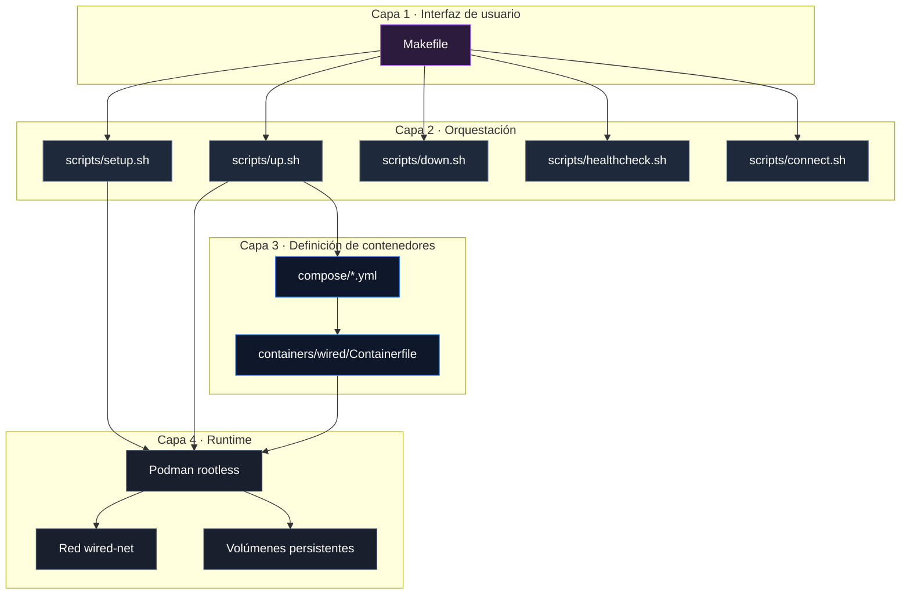
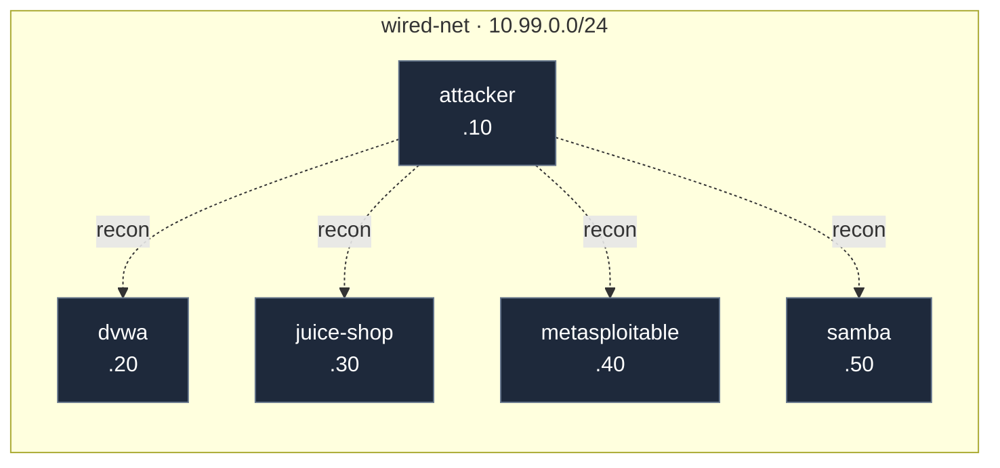
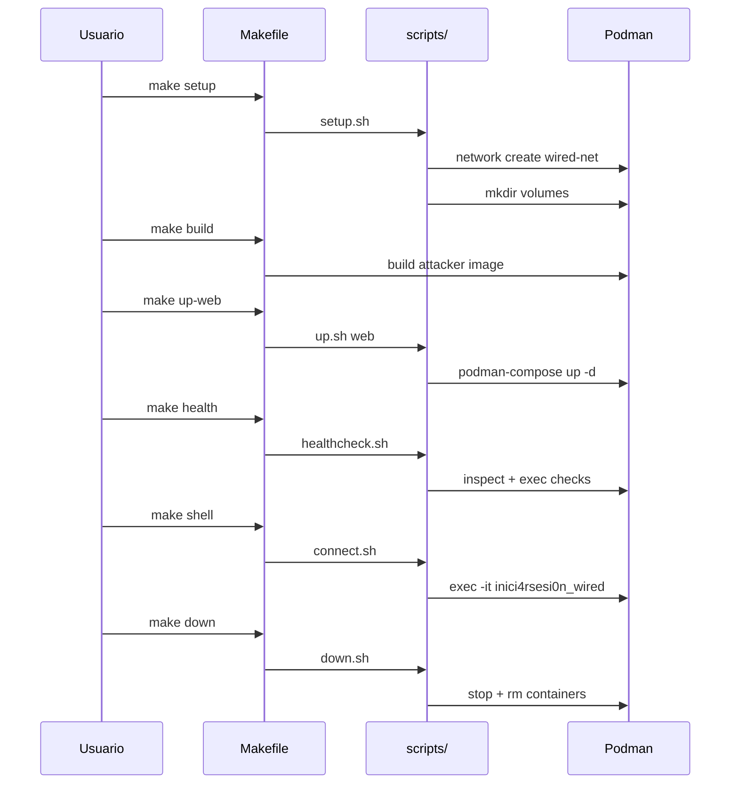
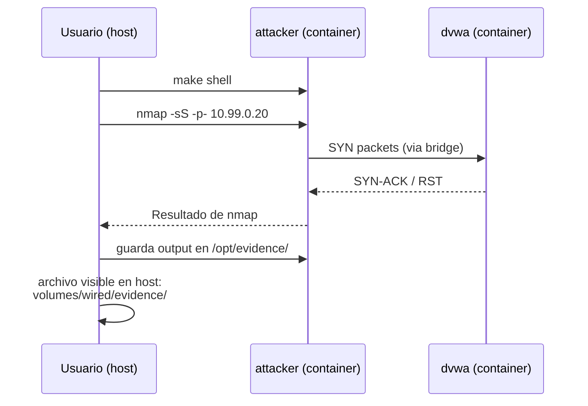

# Arquitectura del Laboratorio

Este documento describe en detalle cómo está construido el laboratorio: sus componentes, la red, el almacenamiento, el ciclo de vida y los puntos de extensión. Es complementario al [`README.md`](../README.md), que ofrece una vista general de uso.

**Audiencia:** desarrolladores que quieran extender el laboratorio, revisores técnicos que evalúen decisiones de diseño, o el propio autor como referencia futura.

---

## 1. Principios de Diseño

Cinco principios guían cada decisión técnica en este laboratorio.

### 1.1 Reproducibilidad

Cualquier persona con Podman 4.9+ y GNU Make debe poder clonar el repositorio, ejecutar `make setup && make build && make up-web`, y obtener un entorno idéntico. No hay pasos manuales, ni instalaciones ad-hoc, ni estados ocultos.

**Implicación:** toda configuración vive en archivos versionados (`.env.example`, `Containerfile`, `podman-compose.*.yml`). Nada depende del estado del host más allá de Podman y Make.

### 1.2 Aislamiento

El laboratorio no interfiere con la red del host. Los contenedores viven en `10.99.0.0/24`, una subnet dedicada sin NAT, sin exposición a Internet y sin dependencias externas.

**Implicación:** las herramientas del atacante están preinstaladas en la imagen. Si falta algo, se añade al `Containerfile` y se reconstruye la imagen; no se instala en caliente.

### 1.3 Modularidad

Los perfiles permiten levantar solo lo necesario para cada reto. En un host con 4 GB de RAM disponibles, esto no es una preferencia: es un requisito de viabilidad.

**Implicación:** cuatro archivos compose independientes (`recon`, `web`, `smb`, `full`), con servicios comunes (`attacker`) y específicos por perfil.

### 1.4 Simplicidad operativa

Un único Makefile como interfaz. Bash para orquestación. YAML para la definición de contenedores. Sin frameworks, sin dependencias ocultas, sin magia.

**Implicación:** cualquier persona con conocimientos básicos de Linux, Podman y Bash puede entender y modificar el laboratorio.

### 1.5 Seguridad defensiva

El atacante es el único contenedor con capabilities especiales (`NET_ADMIN`, `NET_RAW`). Los objetivos operan sin privilegios adicionales. El laboratorio no expone servicios innecesarios al host.

**Implicación:** solo DVWA y Juice Shop publican puertos al host, y únicamente para facilitar retos web desde el navegador.

---

## 2. Vista de Componentes

El laboratorio se organiza en cuatro capas lógicas.



Cada capa tiene una responsabilidad única y bien delimitada. Los cambios se aíslan: modificar un script no afecta a los compose, y modificar un compose no requiere tocar el Makefile.

---

## 3. Red y Aislamiento

### 3.1 Subnet dedicada

| Parámetro | Valor | Razón |
|-----------|-------|-------|
| Nombre | `wired-net` | Identificable sin ambigüedad |
| Subnet | `10.99.0.0/24` | Fuera de rangos comunes (RFC 1918 estándar: `10.0.0.0/8`, pero `10.99.x.x` es poco frecuente) |
| Gateway | `10.99.0.1` | Gestionado por Podman |
| Driver | `bridge` | Estándar para contenedores en la misma red virtual |
| NAT | **Deshabilitado** | Decisión consciente (ver ADR-004) |

### 3.2 Asignación estática de IPs

Cada contenedor tiene una IP fija definida en `.env`. Esto elimina la dependencia de DHCP interno y simplifica los scripts que se conectan a direcciones conocidas.



### 3.3 Por qué no hay NAT

El laboratorio no tiene salida a Internet. Es una decisión de diseño, no una limitación.

**Ventajas:**

- Reproducibilidad: el laboratorio no depende de servicios externos.
- Aislamiento: ningún contenedor puede "llamar a casa".
- Higiene: no hay tráfico saliente accidental durante las pruebas.
- Realismo: simula una red empresarial cerrada.

**Implicación operativa:** cualquier herramienta nueva debe añadirse al `Containerfile` y reconstruir la imagen con `make build`. Ver ADR-004 para el análisis completo.

### 3.4 DNS interno de Podman

Los contenedores se resuelven entre sí por nombre (`attacker`, `dvwa`, etc.) además de por IP. Esto permite escribir scripts legibles sin hardcodear direcciones.

```
[atacante]$ getent hosts dvwa
10.99.0.20    dvwa.dns.podman
```

---

## 4. Almacenamiento y Volúmenes

### 4.1 Estructura de volúmenes

Los volúmenes montados desde el host son la única forma de persistencia entre ciclos `down` / `up`.

```text
volumes/
├── wired/
│   ├── scripts/      → montado en /opt/scripts      (rw)
│   ├── evidence/     → montado en /opt/evidence     (rw)
│   └── reports/      → montado en /opt/reports      (rw)
└── samba/
    └── shares/
        └── workfiles/ → montado en /share/workfiles (rw)
```

### 4.2 Configuración de Neovim

La configuración personal de Neovim del host se monta dentro del atacante:

```text
${NVIM_CONFIG_PATH}  →  /root/.config/nvim  (rw)
```

Esto permite editar scripts con el setup habitual del usuario mientras se trabaja dentro del contenedor.

**Nota:** los archivos creados por el atacante aparecen con propietario `root` en el host. Para transferirlos al usuario, se ejecuta:

```bash
sudo chown -R $USER:$USER volumes/wired/
```

### 4.3 Separación de responsabilidades

| Directorio | Propósito | Versionado |
|------------|-----------|------------|
| `volumes/wired/scripts/` | Scripts de reconocimiento/explotación | Sí |
| `volumes/wired/evidence/` | Salidas de herramientas, capturas | No (`.gitignore`) |
| `volumes/wired/reports/` | Reportes generados | No (`.gitignore`) |
| `volumes/samba/shares/` | Contenido de los shares SMB | Sí |

---

## 5. Ciclo de Vida del Laboratorio

### 5.1 Secuencia completa



### 5.2 Estados del laboratorio

| Estado | Descripción | Comando para entrar |
|--------|-------------|---------------------|
| **No configurado** | No existe la red ni los volúmenes | `make setup` |
| **Configurado** | Red y volúmenes listos, sin contenedores | `make up-X` |
| **Activo** | Contenedores corriendo para un perfil | `make shell` |
| **Detenido** | Contenedores eliminados, red y volúmenes intactos | `make up-X` |
| **Reseteado** | Todo eliminado (contenedores + red) | `make setup` |

### 5.3 Idempotencia

Todos los comandos son idempotentes:

- `make setup` no falla si la red ya existe.
- `make down` no falla si los contenedores no están corriendo.
- `make up-X` recrea los contenedores aunque ya estuvieran arriba.

Esto permite re-ejecutar sin miedo y facilita el trabajo iterativo.

---

## 6. Seguridad del Contenedor Atacante

### 6.1 Capabilities

El atacante requiere dos capabilities Linux específicas:

| Capability | Uso | Sin ella |
|------------|-----|----------|
| `NET_ADMIN` | Modificar interfaces, ARP spoofing, tcpdump | `tcpdump` falla con "Operation not permitted" |
| `NET_RAW` | Raw sockets, SYN scan | `nmap -sS` cae a TCP connect scan (menos sigiloso) |

Se aplican mediante `cap_add` en cada compose. No se otorgan al resto de contenedores.

### 6.2 Usuario dentro del contenedor

El atacante corre como **root dentro del contenedor** (aislado por Podman rootless). Esto permite:

- Usar `msfconsole` con todos los módulos.
- Escribir en `/etc`, `/root`, `/opt`.
- Ejecutar herramientas que requieren privilegios.

**Decisión documentada en ADR-005.** Se evaluó `keep-id` (usuario del host dentro del contenedor) y se descartó por romper el HOME y limitar el atacante.

### 6.3 Aislamiento respecto al host

| Recurso del host | ¿Accesible desde el atacante? |
|------------------|-------------------------------|
| Sistema de archivos completo | ❌ Solo volúmenes montados |
| Red del host (`192.168.18.0/24`) | ❌ Aislado por Podman |
| USB, dispositivos | ❌ |
| Procesos del host | ❌ |
| Puertos privilegiados (<1024) | ❌ |

---

## 7. Flujo de Datos (Ejemplo)

Escenario: el usuario ejecuta un escaneo de reconocimiento contra DVWA.



**Puntos clave:**

1. El escaneo se origina dentro del bridge `wired-net`.
2. El tráfico nunca sale al host ni a Internet.
3. La evidencia escrita en `/opt/evidence/` es inmediatamente visible en el host gracias al bind mount.

---

## 8. Modelo de Fallos

El laboratorio está diseñado para fallar de forma predecible y diagnosticable.

### 8.1 Fallos conocidos y su comportamiento

| Fallo | Síntoma | Manejo |
|-------|---------|--------|
| Red no creada | `up.sh` imprime `[FALLA] La red 'wired-net' no existe` | Ejecutar `make setup` |
| Imagen no construida | `up-X` intenta construir automáticamente | Esperar ~15 min o correr `make build` primero |
| Puerto 8080 o 3000 ocupado | `up-web` falla con "address already in use" | Cambiar en `.env` |
| RAM insuficiente en `full` | Contenedores reinician o OOM-kill | Usar perfil `web` o `smb` |
| Samba unhealthy | `podman ps` lo marca así | Falso positivo, ignorar |
| DVWA tarda en responder | Curl da HTTP 000 en primeros segundos | Healthcheck reintenta automáticamente |

### 8.2 Diagnóstico

Comandos de diagnóstico rápido:

```bash
make status                    # Estado de contenedores
make health PROFILE=web        # Healthcheck detallado
podman logs <container>        # Logs de un contenedor
podman inspect <container>     # Estado detallado
```

---

## 9. Puntos de Extensión

El laboratorio está diseñado para crecer. Estas son las extensiones más comunes y cómo abordarlas.

### 9.1 Añadir un nuevo objetivo vulnerable

1. Añadir la imagen y variables en `.env.example` y `.env`.
2. Añadir el servicio al compose correspondiente (`web`, `smb`, `full`).
3. Asignar IP estática.
4. Actualizar `healthcheck.sh` si el nuevo servicio requiere checks específicos.
5. Documentar en `README.md` y `docs/credentials.md`.

### 9.2 Añadir una herramienta al atacante

1. Añadir el paquete a la línea `apt-get install` del `Containerfile`.
2. Ejecutar `make rebuild` (sin caché).
3. Actualizar `containers/wired/tools.txt` con la nueva herramienta.

### 9.3 Añadir un nuevo perfil

1. Crear `compose/podman-compose.<nombre>.yml` copiando uno existente.
2. Añadir el target `up-<nombre>` al `Makefile`.
3. Añadir las secciones condicionales al `healthcheck.sh`.
4. Documentar el perfil en `README.md`.

### 9.4 Añadir un nuevo ADR

1. Crear `docs/adr/00X-<titulo>.md`.
2. Estructura recomendada: Contexto, Decisión, Consecuencias, Alternativas consideradas.
3. Actualizar la tabla de ADRs en `README.md`.

---

## 10. Referencias

- [README.md](../README.md) — Vista general y guía de uso.
- [troubleshooting.md](troubleshooting.md) — Diagnóstico y solución de problemas.
- [credentials.md](credentials.md) — Credenciales de servicios.
- [docs/adr/](adr/) — Decisiones arquitectónicas detalladas.
- [Podman Documentation](https://docs.podman.io/)
- [podman-compose](https://github.com/containers/podman-compose)
